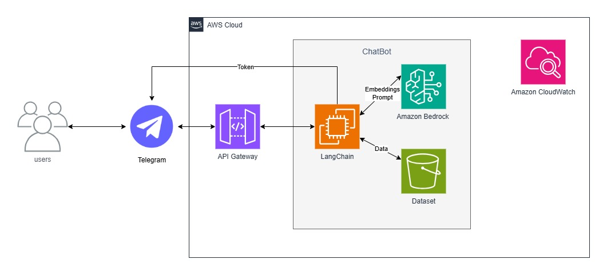

# 🤖 Chatbot Jurídico com IA Generativa na AWS
Avaliação das <b>Sprints 7 e 8</b> do Scholarship Compass UOL para formação em Inteligência Artificial para AWS.
Desenvolvido pelo <b>Squad 1</b>

<kbd>Sumário</kbd>

- 🔍 [Visão Geral](#visão-geral)
- 🏛️ [Arquitetura](#arquitetura)
- 💼 [Tecnologias Utilizadas](#tecnologias-utilizadas)
- 📂 [Estrutura de Pastas](#estrutura-de-pastas)
- 🔧 [Funcionalidades](#funcionalidades)
- 🧪 [Testes e Exemplos](#testes-e-exemplos)
- ℹ️ [Como usar a aplicação](#como-usar-a-aplicação)
- 🧑‍💻 [Desenvolvimento do Projeto](#desenvolvimento-do-projeto)
- 🤯 [Dificuldades Encontradas](#dificuldades-encontradas)
- 👥 [Integrantes do Squad](#integrantes-do-squad)

<h2 id="visão-geral">🔍 Visão Geral</h2>
Um chatbot inteligente integrado ao Telegram, capaz de responder a perguntas em <b>linguagem natural</b> com base em documentos jurídicos.
A solução utiliza <b>RAG (Retrieval-Augmented Generation)</b> para garantir respostas precisas e contextuais, buscando informações diretamente de <b>PDFs armazenados com segurança na AWS</b>.

<a href="#readme-top"><kbd>VOLTAR AO TOPO</kbd></a>

<h2 id="arquitetura">🏛️ Arquitetura</h2>
A arquitetura é <b>robusta e escalável</b>, utilizando os principais serviços da AWS.
O fluxo de dados segue o padrão de <b>webhook</b>:

`Telegram → API Gateway → EC2 → LangChain (busca no S3 + geração no Bedrock)`

<a href="#readme-top"><kbd>VOLTAR AO TOPO</kbd></a>

<h2 id="tecnologias-utilizadas">💼 Tecnologias Utilizadas</h2>
<ul>
<li>Python 3.9+</li>
<li><b>AWS EC2</b> (Hospedagem da aplicação)</li>
<li><b>AWS S3</b> (Armazenamento de documentos)</li>
<li><b>AWS Bedrock</b> (Amazon Titan para IA generativa)</li>
<li><b>AWS API Gateway</b> (Webhook do Telegram)</li>
<li><b>AWS CloudWatch</b> (Logs e monitoramento)</li>
<li><b>LangChain</b> (Orquestração RAG)</li>
<li><b>ChromaDB</b> (Banco vetorial de embeddings)</li>
<li><b>Telegram API</b> (Interface com o usuário)</li>
</ul>

<h2 id="estrutura-de-pastas">📂 Estrutura de Pastas</h2>
<pre><code>┌─ src/
│  ├─ __init__.py
│  ├─ bot.py
│  ├─ config.py
│  ├─ logging_config.py
│  └─ vectorizer.py
├─ .gitignore
├─ create_database.py
├─ requirements.txt
└─ run_bot.py
</code></pre>

<h2 id="funcionalidades">🔧 Funcionalidades</h2>
<ul>
<li>Responder perguntas em linguagem natural.</li>
<li>Buscar informações jurídicas diretamente em documentos armazenados no S3.</li>
<li>Utilizar embeddings para recuperação eficiente de conhecimento.</li>
<li>Manter registros de execução e erros via CloudWatch.</li>
<li>Executar em ambiente escalável na AWS EC2.</li>
</ul>

<h2 id="testes-e-exemplos">🧪 Testes e Exemplos</h2>
Você pode interagir com o bot diretamente no Telegram através do handle <b>@Squad1chatbot</b>.
Os exemplos abaixo demonstram a capacidade de <b>Recuperação Aumentada de Geração (RAG)</b> do bot em documentos jurídicos. 

--
<li><b>⚠️ Importante:</b> Para garantir a máxima precisão e evitar respostas ambíguas, o bot foi projetado para responder apenas quando a pergunta contém o ID ou número do processo presente nos documentos. Consultas sem o ID não serão processadas, pois a busca genérica é propensa a erros de contexto.</li>

### 1. Teste para o documento `54-decisao-admissibilidade.pdf`
| Pergunta para o bot | Resposta Correta Esperada |
| :--- | :--- |
| Qual a decisão de admissibilidade do processo **RE1463299**? | **admito o recurso extraordinário.** (ou **similar.**) |

### 2. Teste para o documento `24-acordao-embargos.pdf`
| Pergunta para o bot | Resposta Correta Esperada |
| :--- | :--- |
| Qual foi o resultado do julgamento dos Embargos de Declaração no processo **ARE1467492**? | **negar provimento...** |

### 3. Teste para o documento `22-acordao-recorrido.pdf`
| Pergunta para o bot | Resposta Correta Esperada |
| :--- | :--- |
| Qual o valor do título executivo constituído no processo **ARE1467492**? | **R$ 178.265,86** |

### 4. Teste para o documento `20-acordao-embargos.pdf`
| Pergunta para o bot | Resposta Correta Esperada |
| :--- | :--- |
| Qual foi a decisão da Turma sobre os embargos de declaração no processo **RE1461810**? | **rejeitar os embargos de declaração.** |

<a href="#readme-top"><kbd>VOLTAR AO TOPO</kbd></a>

<h2 id="como-usar-a-aplicação">ℹ️ Como usar a aplicação</h2>

O processo de execução é feito em uma instância EC2 na AWS. Siga os passos abaixo.

### 1️⃣ Pré-requisitos
<ul>
<li>Uma conta na <b>AWS</b> com uma instância <b>EC2</b> já criada (preferencialmente Amazon Linux ou Ubuntu).</li>
<li>O par de chaves (arquivo <b>.pem</b>) da sua instância EC2 salvo no seu computador e com as permissões corretas (<code>SUA_CHAVE.pem</code>).</li>
<li><b>Git</b> e <b>Python 3.9+</b> instalados no seu computador local.</li>
<li>Um <b>token de bot do Telegram</b>, gerado pelo <code>@BotFather</code>.</li>
</ul>

### 2️⃣ Preparação Local do Projeto

No seu computador, antes de enviar para a nuvem:

1.  <b>Clone o repositório:</b>
<pre><code>git clone https://github.com/Compass-pb-aws-2025-JUNHO/sprints-7-8-junho.git
cd sprints-7-8-junho
git checkout squad-1
</code></pre>

2.  <b>Crie e preencha o arquivo <code>.env</code>:</b>
    Dentro da pasta do projeto, crie o arquivo <code>.env</code>. 
<pre><code>BOT_TOKEN=SEU_TOKEN_DO_TELEGRAM
S3_BUCKET_NAME="seu-bucket"
AWS_REGION_NAME="us-east-1"
CLOUDWATCH_LOG_GROUP="ChatbotJuridicoLogs"
ENVIRONMENT="production"
</code></pre>

### 3️⃣ Deploy: Copiando os Arquivos para o EC2

Agora, copie a pasta inteira do projeto do seu computador para a instância EC2 usando o comando `scp`. Abra o terminal na pasta onde está seu arquivo `.pem` e execute:

<pre><code>scp -i "SUA_CHAVE.pem" -r caminho/para/chatbot-juridico ec2-user@SEU_IP_PUBLICO:~
</code></pre>
<ul>
<li>Troque <code>"SUA_CHAVE.pem"</code> pelo nome do seu arquivo de chave.</li>
<li>Troque <code>caminho/para/chatbot-juridico</code> pelo caminho e nome da pasta do projeto no seu computador.</li>
<li>Troque <code>ec2-user@SEU_IP_PUBLICO</code> pelo usuário e IP da sua instância EC2.</li>
</ul>

### 4️⃣ Execução no Servidor EC2

1.  <b>Conecte-se à sua instância via SSH:</b>
<pre><code>ssh -i "SUA_CHAVE.pem" ec2-user@SEU_IP_PUBLICO
</code></pre>

2.  <b>Acesse a pasta do projeto e configure o ambiente:</b>
    Uma vez conectado, execute os seguintes comandos no terminal do EC2:
<pre><code># Acesse a pasta que você acabou de copiar
cd chatbot-juridico

# Crie e ative o ambiente virtual
python3 -m venv venv
source venv/bin/activate

# Instale as dependências
pip install -r requirements.txt
</code></pre>

3.  <b>Execute a aplicação:</b>
<pre><code># 1. Crie a base de dados vetorial
python3 create_database.py

# 2. Inicie o bot
# (Use 'nohup' para mantê-lo rodando mesmo após fechar o terminal)
nohup python3 run_bot.py 
</code></pre>

<h2 id="desenvolvimento-do-projeto">🧑‍💻 Desenvolvimento do Projeto</h2>
O desenvolvimento seguiu metodologia ágil, com foco nas sprints definidas pelo programa:

- <b>Sprint 7:</b> Criação do pipeline de ingestão de documentos, configuração do LangChain e integração inicial com o Telegram.
- <b>Sprint 8:</b> Deploy na AWS, otimização do banco vetorial com ChromaDB, integração com Bedrock e testes de escalabilidade.

<a href="#readme-top"><kbd>VOLTAR AO TOPO</kbd></a>

<h2 id="dificuldades-encontradas">🤯 Dificuldades Encontradas</h2>
<ul>
<li>Configuração do Webhook do Telegram via API Gateway.</li>
<li>Gerenciamento de permissões no IAM da AWS.</li>
<li>Ajustes de compatibilidade entre embeddings no ChromaDB e a geração do Bedrock.</li>
<li>Escalabilidade e tempo de resposta em consultas mais complexas.</li>
</ul>

<h2 id="integrantes-do-squad">👥 Integrantes do Squad</h2>
<ul>
<li><a href="https://github.com/naatrz">Ana Beatriz Viana</a></li>
<li><a href="https://github.com/Clebers0n">Cleberson França</a></li>
<li><a href="https://github.com/clauriss">Clara Lima</a></li>
<li><a href="https://github.com/Lukasdevoli">Lucas Oliveira</a></li>
<li><a href="https://github.com/Vitoriokaua">Vitório Rufino</a></li>
</ul>
<a href="#readme-top"><kbd>VOLTAR AO TOPO</kbd></a>
